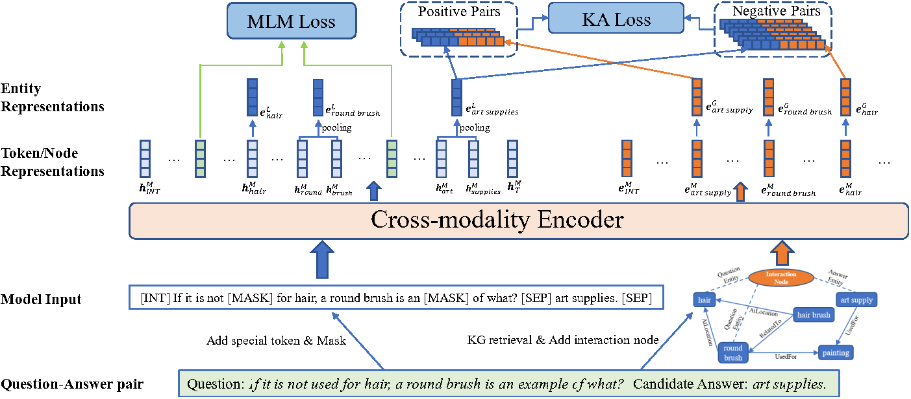

## FiTs: Fine-grained Two-stage Training for Knowledge Base Question Answering

PyTorch Implementation of paper:

> **FiTs: Fine-grained Two-stage Training for Knowledge Base Question Answering (AAAI 2023)**
> 
> Bowen Cao\*, Qichen Ye\*, Nuo Chen, Weiyuan Xu, Yuexian Zou. (\* denotes equal contribution)



## Introduction
Knowledge-aware question answering (KAQA) requires the model to answer questions over a knowledge base, which is essential for both open-domain QA and domain-specific QA, especially when language models alone cannot provide all the knowledge needed.
Despite the promising result of recent KAQA systems which tend to integrate linguistic knowledge from pre-trained language models (PLM) and factual knowledge from knowledge graphs (KG) to answer complex questions, a bottleneck exists in effectively fusing the representations from PLMs and KGs because of (i) the semantic and distributional gaps between them, and (ii) the difficulties in joint reasoning over the provided knowledge from both modalities.

To address the above two problems, we propose a Fine-grained Two-stage training framework (FiTs) to boost the KAQA system performance: The first stage aims at aligning representations from the PLM and the KG, thus bridging the modality gaps between them, named knowledge adaptive post-training. The second stage, called knowledge-aware fine-tuning, aims to improve the model's joint reasoning ability based on the aligned representations.

In detail,  we fine-tune the post-trained model via two auxiliary self-supervised tasks in addition to the QA supervision.
Extensive experiments demonstrate that our approach achieves state-of-the-art performance on three benchmarks in the commonsense reasoning (i.e., CommonsenseQA, OpenbookQA) and medical question answering (i.e., MedQA-USMILE) domains.

Paper link: [ArXiv](https://arxiv.org/abs/2302.11799)

## Running Experiments

### 1. Download data

Download all the raw data -- ConceptNet, CommonsenseQA, OpenBookQA -- by
```
bash ./scripts/download_raw_data.sh
```

You can preprocess the raw data by running
```
CUDA_VISIBLE_DEVICES=0 python preprocess.py -p <num_processes>
```
You can specify the GPU you want to use in the beginning of the command `CUDA_VISIBLE_DEVICES=...`. The script will:
* Setup ConceptNet (e.g., extract English relations from ConceptNet, merge the original 42 relation types into 17 types)
* Convert the QA datasets into .jsonl files (e.g., stored in `data/csqa/statement/`)
* Identify all mentioned concepts in the questions and answers
* Extract subgraphs for each q-a pair

**Add MedQA-USMLE**. Besides the commonsense QA datasets (*CommonsenseQA*, *OpenBookQA*) with the ConceptNet knowledge graph, we added a biomedical QA dataset ([*MedQA-USMLE*](https://github.com/jind11/MedQA)) with a biomedical knowledge graph based on Disease Database and DrugBank. You can download all the data for this from [[here]](https://drive.google.com/file/d/1EqbiNt2ACXVrc9gmoXnzTEo9GJTe9Uor/view?usp=sharing). Unzip it and put the `medqa_usmle` and `ddb` folders inside the `data/` directory.

### 2. Post-training

```shell
bash scripts/run_post_train.sh
```
### 3. Fine-tuning
```shell
bash scripts/run_finetune.sh
```

## Reference
If you use FiTs in a research paper, please cite our work as follows:
```
@misc{https://doi.org/10.48550/arxiv.2302.11799,
  doi = {10.48550/ARXIV.2302.11799},
  url = {https://arxiv.org/abs/2302.11799},
  author = {Ye, Qichen and Cao, Bowen and Chen, Nuo and Xu, Weiyuan and Zou, Yuexian},
  keywords = {Computation and Language (cs.CL), Machine Learning (cs.LG), FOS: Computer and information sciences, FOS: Computer and information sciences},
  title = {FiTs: Fine-grained Two-stage Training for Knowledge-aware Question Answering},
  publisher = {arXiv},
  year = {2023},
  copyright = {Creative Commons Attribution 4.0 International}
}

```

## Acknowledgment
This repo is built upon the following work:
```
GreaseLM: Graph REASoning Enhanced Language Models  
https://github.com/XikunZhang/greaselm
```
Many thanks to the authors and developers!